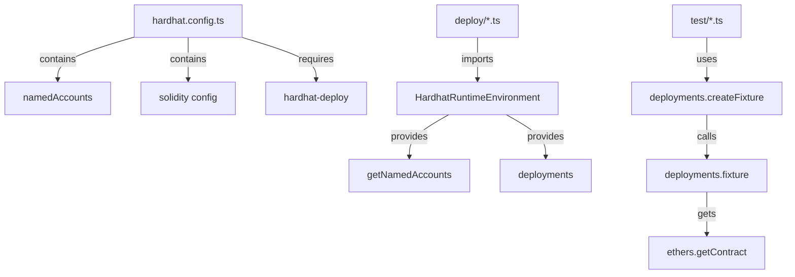

# SKILL: Migrate hardhat-deploy v1 to v2

This guide provides comprehensive instructions for migrating projects from hardhat-deploy v1 to v2. It's designed for AI assistants to understand and execute the migration process systematically.

> **Note**: For complete working examples, see the [template-ethereum-contracts](https://github.com/wighawag/template-ethereum-contracts) repository which demonstrates a full hardhat-deploy v2 setup.

## Table of Contents

1. [Introduction](#introduction)
2. [Prerequisites Check](#prerequisites-check)
3. [Architecture Comparison](#architecture-comparison)
4. [Step-by-Step Migration](#step-by-step-migration)
5. [Common Patterns & Examples](#common-patterns--examples)
6. [Troubleshooting Guide](#troubleshooting-guide)
7. [Migration Checklist](#migration-checklist)
8. [Advanced Topics](#advanced-topics)

---

## Introduction

### Overview

hardhat-deploy v2 is a complete rewrite that requires Hardhat 3.x and introduces significant architectural changes:

- **ESM Modules**: v2 uses native ES modules (`import`/`export`) instead of CommonJS
- **Rocketh Integration**: v2 integrates with the rocketh ecosystem for deployment management
- **Configuration Changes**: Named accounts moved from hardhat.config.ts to rocketh/config.ts
- **Plugin System**: Enhanced extensibility through rocketh extensions

### Key Differences Summary

| Aspect                   | v1 Pattern                            | v2 Pattern                                                 |
| ------------------------ | ------------------------------------- | ---------------------------------------------------------- |
| **Hardhat version**      | 2.x                                   | 3.x (specifically `^3.1.5`)                                |
| **Module system**        | CommonJS (`require`/`module.exports`) | ESM (`import`/`export`)                                    |
| **Named accounts**       | `namedAccounts` in hardhat.config.ts  | `rocketh/config.ts`                                        |
| **Deploy function**      | `deployments.deploy(name, {...})`     | `deploy(name, {account: ..., artifact: ...})`              |
| **Deployer param**       | `from: address`                       | `account: address`                                         |
| **Solidity config**      | `solidity: "0.8.x"`                   | `solidity: {profiles: {default: {version: "..."}}}`        |
| **Test fixtures**        | `deployments.createFixture()`         | Custom fixture with `loadAndExecuteDeploymentsFromFiles()` |
| **Contract interaction** | `ethers.getContract()`                | `env.get()` + `env.execute()`                              |

### When to Stay on v1

If you have a production project using hardhat-deploy v1 with Hardhat 2.x, it's often better to stay on v1:

```bash
npm uninstall hardhat-deploy
npm install hardhat-deploy@1
```

v1 continues to receive security fixes but won't get new features.

---

## Prerequisites Check

Before starting the migration, verify your environment meets these requirements:

### Checklist

```bash
# Check Node.js version (requires 22+ for v2)
node --version

# Check Hardhat version (requires 3.x+ for v2)
npx hardhat --version

# Check if project is using CommonJS or ESM
grep -q '"type": "module"' package.json && echo "ESM" || echo "CommonJS"
```

### Required Versions

- **Node.js**: 22 or higher
- **Hardhat**: 3.x or higher (specifically `^3.1.5` recommended)
- **TypeScript**: 5.x (for TypeScript projects)

### Pre-Migration Assessment

Check for these v1 patterns in your project:

```typescript
// In hardhat.config.ts
- namedAccounts configuration
- require() statements
- module.exports
- solidity: "0.8.x" format

// In deploy scripts
- async function (hre) { ... }
- hre.deployments.deploy()
- hre.getNamedAccounts()
- from: parameter
- log: true parameter

// In tests
- deployments.createFixture()
- ethers.getContract()
- getUnnamedAccounts()
```

---

## Architecture Comparison

### v1 Architecture



**Key Files in v1**:

- `hardhat.config.ts` - Single configuration file
- `deploy/*.ts` - Deploy scripts with HRE pattern
- `test/*.ts` - Tests using deployments fixture
- `utils/network.ts` - Network configuration helper

### v2 Architecture

```mermaid
graph TD
    A[hardhat.config.ts] -->|imports plugins| B[HardhatDeploy]
    A -->|uses helpers| C[addNetworksFromEnv]
    A -->|contains| D[solidity profiles]

    E[rocketh/config.ts] -->|contains| F[accounts config]
    E -->|contains| G[extensions]

    H[rocketh/deploy.ts] -->|exports| I[deployScript]
    H -->|exports| J[artifacts]

    K[rocketh/environment.ts] -->|exports| L[loadEnvironmentFromHardhat]
    K -->|exports| M[loadAndExecuteDeploymentsFromFiles]

    N[deploy/*.ts] -->|imports| I
    N -->|uses| J

    O[test/*.ts] -->|imports| M
    O -->|uses| env.get and env.execute
```

**Key Files in v2**:

- `hardhat.config.ts` - Hardhat configuration (no named accounts)
- `rocketh/config.ts` - Named accounts and extensions
- `rocketh/deploy.ts` - Deploy script setup
- `rocketh/environment.ts` - Environment setup for tests/scripts
- `deploy/*.ts` - Deploy scripts with new pattern
- `test/*.ts` - Tests using new fixture pattern

---

## Step-by-Step Migration

### Step 1: Update Dependencies

Update your `package.json` to use Hardhat 3.x and hardhat-deploy v2:

**v1 package.json example:**

```json
{
  "devDependencies": {
    "hardhat": "^2.22.18",
    "hardhat-deploy": "^0.14.0",
    "hardhat-deploy-ethers": "^0.4.2",
    "hardhat-deploy-tenderly": "^1.0.0",
    "ethers": "^6.13.5",
    "hardhat-deploy": "^0.14.0"
  }
}
```

**v2 package.json example:** (see [template-ethereum-contracts/package.json](https://github.com/wighawag/template-ethereum-contracts/blob/main/contracts/package.json))

```json
{
  "type": "module",
  "devDependencies": {
    "hardhat": "^3.1.4",
    "hardhat-deploy": "^2.0.0",
    "rocketh": "^0.17.15",
    "@rocketh/deploy": "^0.17.9",
    "@rocketh/read-execute": "^0.17.9",
    "@rocketh/node": "^0.17.18",
    "@rocketh/proxy": "^0.17.13",
    "@rocketh/signer": "^0.17.9",
    "viem": "^2.45.0",
    "earl": "^2.0.0",
    "@nomicfoundation/hardhat-viem": "^3.0.1",
    "@nomicfoundation/hardhat-node-test-runner": "^3.0.8",
    "@nomicfoundation/hardhat-network-helpers": "^3.0.3",
    "@nomicfoundation/hardhat-keystore": "^3.0.3"
  }
}
```

**Transformation Rules**:

1. Add `"type": "module"` at the top level
2. Update `hardhat` to `^3.1.4` or higher
3. Update `hardhat-deploy` to `^2.0.0` or higher
4. Remove `hardhat-deploy-ethers` and `hardhat-deploy-tenderly`
5. Add rocketh packages: `rocketh`, `@rocketh/deploy`, `@rocketh/read-execute`, `@rocketh/node`, `@rocketh/signer`
6. Add optional packages: `@rocketh/proxy`, `@rocketh/export`, `@rocketh/verifier`, `@rocketh/doc`
7. Add `viem` for contract interactions
8. Add `earl` for assertions (for node:test)
9. Add Hardhat 3.x plugins

**Install dependencies**:

```bash
pnpm install
```

### Step 2: Restructure Configuration

#### 2.1 Convert hardhat.config.ts

**v1 hardhat.config.ts example:**

```typescript
import "dotenv/config";
import { HardhatUserConfig } from "hardhat/types";

import "@nomicfoundation/hardhat-chai-matchers";
import "@nomicfoundation/hardhat-ethers";
import "@typechain/hardhat";

import "hardhat-deploy";
import "hardhat-deploy-ethers";
import "hardhat-deploy-tenderly";

import { node_url, accounts, addForkConfiguration } from "./utils/network";

const config: HardhatUserConfig = {
  solidity: {
    compilers: [
      {
        version: "0.8.17",
        settings: {
          optimizer: {
            enabled: true,
            runs: 2000,
          },
        },
      },
    ],
  },
  namedAccounts: {
    deployer: 0,
    simpleERC20Beneficiary: 1,
  },
  networks: addForkConfiguration({
    hardhat: {
      initialBaseFeePerGas: 0,
    },
    localhost: {
      url: node_url("localhost"),
      accounts: accounts(),
    },
    mainnet: {
      url: node_url("mainnet"),
      accounts: accounts("mainnet"),
    },
    sepolia: {
      url: node_url("sepolia"),
      accounts: accounts("sepolia"),
    },
  }),
  paths: {
    sources: "src",
  },
  mocha: {
    timeout: 0,
  },
  external: process.env.HARDHAT_FORK
    ? {
        deployments: {
          hardhat: ["deployments/" + process.env.HARDHAT_FORK],
          localhost: ["deployments/" + process.env.HARDHAT_FORK],
        },
      }
    : undefined,
};

export default config;
```

**v2 hardhat.config.ts example:** (see [template-ethereum-contracts/hardhat.config.ts](https://github.com/wighawag/template-ethereum-contracts/blob/main/contracts/hardhat.config.ts))

```typescript
import type { HardhatUserConfig } from "hardhat/config";

import HardhatNodeTestRunner from "@nomicfoundation/hardhat-node-test-runner";
import HardhatViem from "@nomicfoundation/hardhat-viem";
import HardhatNetworkHelpers from "@nomicfoundation/hardhat-network-helpers";
import HardhatKeystore from "@nomicfoundation/hardhat-keystore";

import HardhatDeploy from "hardhat-deploy";
import {
  addForkConfiguration,
  addNetworksFromEnv,
  addNetworksFromKnownList,
} from "hardhat-deploy/helpers";

const config: HardhatUserConfig = {
  plugins: [
    HardhatNodeTestRunner,
    HardhatViem,
    HardhatNetworkHelpers,
    HardhatKeystore,
    HardhatDeploy,
  ],
  solidity: {
    profiles: {
      default: {
        version: "0.8.17",
      },
      production: {
        version: "0.8.17",
        settings: {
          optimizer: {
            enabled: true,
            runs: 999999,
          },
        },
      },
    },
  },
  networks:
    // This add the fork configuration for chosen network
    addForkConfiguration(
      // this add a network config for all known chain using kebab-cases names
      // Note that MNEMONIC_<network> (or MNEMONIC if the other is not set) will
      // be used for account
      // Similarly ETH_NODE_URI_<network> will be used for rpcUrl
      // Note that if you set these env variable to have the value: "SECRET" it will be like using:
      //  configVariable('SECRET_ETH_NODE_URI_<network>')
      //  configVariable('SECRET_MNEMONIC_<network>')
      addNetworksFromKnownList(
        // this add network for each respective env var found (ETH_NODE_URI_<network>)
        // it will also read MNEMONIC_<network> to populate the accounts
        // And like above it will use configVariable if set to SECRET
        addNetworksFromEnv(
          // and you can add in your specific network here
          {
            default: {
              type: "edr-simulated",
              chainType: "l1",
              accounts: {
                mnemonic: process.env.MNEMONIC || undefined,
              },
            },
          },
        ),
      ),
    ),
  paths: {
    sources: ["src"],
  },
  generateTypedArtifacts: {
    destinations: [
      {
        folder: "./generated",
        mode: "typescript",
      },
    ],
  },
};

export default config;
```

**Transformation Rules**:

1. Change from `import 'hardhat-deploy'` to `import HardhatDeploy from 'hardhat-deploy'`
2. Remove `namedAccounts` section entirely
3. Convert `solidity.compilers` to `solidity.profiles`
4. Add `plugins` array with imported plugins
5. Use helper functions from `hardhat-deploy/helpers` for network configuration
6. Add `generateTypedArtifacts` configuration
7. Remove `mocha` timeout configuration (not needed in v2)
8. Remove `external.deployments` configuration (handled differently)
9. Delete `utils/network.ts` file (no longer needed)

#### 2.5 Update tsconfig.json for ESM

**v1 tsconfig.json example:**

```json
{
  "compilerOptions": {
    "target": "es5",
    "module": "commonjs",
    "strict": true,
    "esModuleInterop": true,
    "moduleResolution": "node",
    "forceConsistentCasingInFileNames": true,
    "outDir": "dist"
  },
  "include": [
    "hardhat.config.ts",
    "./scripts",
    "./deploy",
    "./test",
    "typechain/**/*"
  ]
}
```

**v2 tsconfig.json example:**

```json
{
  "compilerOptions": {
    "lib": ["es2023"],
    "module": "node16",
    "target": "es2022",
    "moduleResolution": "node16",
    "strict": true,
    "esModuleInterop": true,
    "skipLibCheck": true,
    "sourceMap": true,
    "declaration": true,
    "declarationMap": true,
    "outDir": "dist",
    "rootDir": "."
  },
  "include": ["deploy", "generated"]
}
```

**Create scripts/tsconfig.json:**

```json
{
  "extends": "../tsconfig.json",
  "compilerOptions": {
    "noEmit": true,
    "rootDir": ".."
  },
  "include": ["**/*", "../generated/**/*", "../rocketh/**/*"],
  "exclude": []
}
```

**Create test/tsconfig.json:**

```json
{
  "extends": "../tsconfig.json",
  "compilerOptions": {
    "noEmit": true,
    "rootDir": ".."
  },
  "include": [
    "**/*",
    "../generated/**/*",
    "../rocketh/**/*",
    "../hardhat.config.ts"
  ],
  "exclude": []
}
```

**Transformation Rules for tsconfig.json**:

1. Update `module` from `commonjs` to `node16`
2. Update `target` from `es5` to `es2022`
3. Update `moduleResolution` from `node` to `node16`
4. Add `lib: ["es2023"]`
5. Add `skipLibCheck: true`
6. Add `sourceMap: true`, `declaration: true`, `declarationMap: true`
7. Change `include` to only `["deploy", "generated"]`
8. Create `scripts/tsconfig.json` extending the main config
9. Create `test/tsconfig.json` extending the main config

#### 2.2 Create rocketh/config.ts

**New file: rocketh/config.ts example:** (see [template-ethereum-contracts/rocketh/config.ts](https://github.com/wighawag/template-ethereum-contracts/blob/main/contracts/rocketh/config.ts))

```typescript
// ----------------------------------------------------------------------------
// Typed Config
// ----------------------------------------------------------------------------
import type {
  EnhancedEnvironment,
  UnknownDeployments,
  UserConfig,
} from "rocketh/types";

// this one provide a protocol supporting private key as account
import { privateKey } from "@rocketh/signer";

// we define our config and export it as "config"
export const config = {
  accounts: {
    deployer: {
      default: 0,
    },
    simpleERC20Beneficiary: {
      default: 1,
    },
  },
  data: {},
  signerProtocols: {
    privateKey,
  },
} as const satisfies UserConfig;

// then we import each extensions we are interested in using in our deploy script or elsewhere

// this one provide a deploy function
import * as deployExtension from "@rocketh/deploy";
// this one provide read,execute functions
import * as readExecuteExtension from "@rocketh/read-execute";
// this one provide a deployViaProxy function that let you declaratively
//  deploy proxy based contracts
import * as deployProxyExtension from "@rocketh/proxy";
// this one provide a viem handle to clients and contracts
import * as viemExtension from "@rocketh/viem";

// and export them as a unified object
const extensions = {
  ...deployExtension,
  ...readExecuteExtension,
  ...deployProxyExtension,
  ...viemExtension,
};
export { extensions };

// then we also export the types that our config ehibit so other can use it

type Extensions = typeof extensions;
type Accounts = typeof config.accounts;
type Data = typeof config.data;
type Environment = EnhancedEnvironment<
  Accounts,
  Data,
  UnknownDeployments,
  Extensions
>;

export type { Extensions, Accounts, Data, Environment };
```

**Transformation Rules**:

1. Create `rocketh` directory: `mkdir rocketh`
2. Move `namedAccounts` from hardhat.config.ts to `rocketh/config.ts` under `accounts`
3. Import required rocketh extensions
4. Export extensions as unified object
5. Export TypeScript types for type safety

#### 2.3 Create rocketh/deploy.ts

**New file: rocketh/deploy.ts example:** (see [template-ethereum-contracts/rocketh/deploy.ts](https://github.com/wighawag/template-ethereum-contracts/blob/main/contracts/rocketh/deploy.ts))

```typescript
import {
  type Accounts,
  type Data,
  type Extensions,
  extensions,
} from "./config.js";

// ----------------------------------------------------------------------------
// we re-export the artifacts, so they are easily available from the alias
import * as artifacts from "../generated/artifacts/index.js";
export { artifacts };
// ----------------------------------------------------------------------------
// we create the rocketh functions we need by passing the extensions to the
//  setup function
import { setupDeployScripts } from "rocketh";
const { deployScript } = setupDeployScripts<Extensions, Accounts, Data>(
  extensions,
);

export { deployScript };
```

**Transformation Rules**:

1. Import config and extensions from `./config.js`
2. Import generated artifacts from `../generated/artifacts/index.js`
3. Setup deploy scripts using `setupDeployScripts` from rocketh
4. Export `deployScript` and `artifacts`

#### 2.4 Create rocketh/environment.ts

**New file: rocketh/environment.ts example:** (see [template-ethereum-contracts/rocketh/environment.ts](https://github.com/wighawag/template-ethereum-contracts/blob/main/contracts/rocketh/environment.ts))

```typescript
import {
  type Accounts,
  type Data,
  type Extensions,
  extensions,
} from "./config.js";
import { setupEnvironmentFromFiles } from "@rocketh/node";
import { setupHardhatDeploy } from "hardhat-deploy/helpers";

// useful for test and scripts, uses file-system
const { loadAndExecuteDeploymentsFromFiles } = setupEnvironmentFromFiles<
  Extensions,
  Accounts,
  Data
>(extensions);
const { loadEnvironmentFromHardhat } = setupHardhatDeploy<
  Extensions,
  Accounts,
  Data
>(extensions);

export { loadEnvironmentFromHardhat, loadAndExecuteDeploymentsFromFiles };
```

**Transformation Rules**:

1. Import config and extensions from `./config.js`
2. Setup environment functions from `@rocketh/node` and `hardhat-deploy/helpers`
3. Export `loadEnvironmentFromHardhat` for scripts
4. Export `loadAndExecuteDeploymentsFromFiles` for tests

### Step 3: Convert Deploy Scripts

#### 3.1 Simple Deployment

**v1 deploy script example:**

```typescript
import { HardhatRuntimeEnvironment } from "hardhat/types";
import { DeployFunction } from "hardhat-deploy/types";
import { parseEther } from "ethers";

const func: DeployFunction = async function (hre: HardhatRuntimeEnvironment) {
  const { deployments, getNamedAccounts } = hre;
  const { deploy } = deployments;

  const { deployer, simpleERC20Beneficiary } = await getNamedAccounts();

  await deploy("SimpleERC20", {
    from: deployer,
    args: [simpleERC20Beneficiary, parseEther("1000000000")],
    log: true,
    autoMine: true, // speed up deployment on local network (ganache, hardhat), no effect on live networks
  });
};
export default func;
func.tags = ["SimpleERC20"];
```

**v2 deploy script example:** (see [template-ethereum-contracts/deploy/001_deploy_greetings_registry.ts](https://github.com/wighawag/template-ethereum-contracts/blob/main/contracts/deploy/001_deploy_greetings_registry.ts))

```typescript
import { deployScript, artifacts } from "../rocketh/deploy.js";
import { parseEther } from "viem";

export default deployScript(
  async (env) => {
    const { deployer, simpleERC20Beneficiary } = env.namedAccounts;

    await env.deploy("SimpleERC20", {
      artifact: artifacts.SimpleERC20,
      account: deployer,
      args: [simpleERC20Beneficiary, parseEther("1000000000")],
    });
  },
  {
    tags: ["SimpleERC20"],
  },
);
```

**Transformation Rules**:

1. Remove `HardhatRuntimeEnvironment` and `DeployFunction` imports
2. Import `deployScript` and `artifacts` from `../rocketh/deploy.js`
3. Change `parseEther` from `ethers` to `viem`
4. Wrap function in `deployScript()` call
5. Change parameter from `(hre)` to `(env)`
6. Replace `hre.getNamedAccounts()` with direct `env.namedAccounts` access
7. Replace `hre.deployments.deploy()` with `env.deploy()`
8. Change `from:` to `account:`
9. Add explicit `artifact:` parameter
10. Remove `log:` and `autoMine:` parameters (not needed in v2)
11. Move tags to second argument object instead of `func.tags`

#### 3.2 Proxy Deployment

**v1 proxy deploy script example:**

```typescript
import { HardhatRuntimeEnvironment } from "hardhat/types";
import { DeployFunction } from "hardhat-deploy/types";

const func: DeployFunction = async function (hre: HardhatRuntimeEnvironment) {
  const { deployer } = await hre.getNamedAccounts();
  const { deploy } = hre.deployments;
  const useProxy = !hre.network.live;

  // proxy only in non-live network (localhost and hardhat network) enabling HCR (Hot Contract Replacement)
  // in live network, proxy is disabled and constructor is invoked
  await deploy("GreetingsRegistry", {
    from: deployer,
    proxy: useProxy && "postUpgrade",
    args: [2],
    log: true,
    autoMine: true, // speed up deployment on local network (ganache, hardhat), no effect on live networks
  });

  return !useProxy; // when live network, record the script as executed to prevent rexecution
};
export default func;
func.id = "deploy_greetings_registry"; // id required to prevent reexecution
func.tags = ["GreetingsRegistry"];
```

**v2 proxy deploy script example:** (see [template-ethereum-contracts/deploy/002_deploy_greetings_registry.ts](https://github.com/wighawag/template-ethereum-contracts/blob/main/contracts/deploy/002_deploy_greetings_registry.ts))

```typescript
import { deployScript, artifacts } from "../rocketh/deploy.js";
import { parseEther } from "viem";

export default deployScript(
  async (env) => {
    const { deployer } = env.namedAccounts;
    const useProxy = !env.tags.live;

    // proxy only in non-live network (localhost and hardhat network) enabling HCR (Hot Contract Replacement)
    // in live network, proxy is disabled and constructor is invoked
    await env.deployViaProxy(
      "GreetingsRegistry",
      {
        account: deployer,
        artifact: artifacts.GreetingsRegistry,
        args: ["2"],
      },
      {
        proxyDisabled: !useProxy,
        execute: "postUpgrade",
      },
    );

    return !useProxy; // when live network, record the script as executed to prevent rexecution
  },
  {
    tags: ["GreetingsRegistry"],
    id: "deploy_greetings_registry", // id required to prevent reexecution
  },
);
```

**Transformation Rules for Proxy Deployment**:

1. Change `proxy: useProxy && 'postUpgrade'` to `env.deployViaProxy()` call
2. Move proxy configuration to second argument object
3. Use `proxyDisabled: !useProxy` instead of conditional proxy
4. Use `execute: 'postUpgrade'` instead of proxy type
5. Replace `hre.network.live` with `env.tags.live`

### Step 4: Convert Tests

#### 4.1 Test with Deployments

**v1 test example:**

```typescript
import { expect } from "chai";
import {
  ethers,
  deployments,
  getUnnamedAccounts,
  getNamedAccounts,
} from "hardhat";
import { IERC20 } from "../typechain-types";
import { setupUser, setupUsers } from "./utils";

const setup = deployments.createFixture(async () => {
  await deployments.fixture("SimpleERC20");
  const { simpleERC20Beneficiary } = await getNamedAccounts();
  const contracts = {
    SimpleERC20: await ethers.getContract<IERC20>("SimpleERC20"),
  };
  const users = await setupUsers(await getUnnamedAccounts(), contracts);
  return {
    ...contracts,
    users,
    simpleERC20Beneficiary: await setupUser(simpleERC20Beneficiary, contracts),
  };
});

describe("SimpleERC20", function () {
  it("transfer fails", async function () {
    const { users } = await setup();
    await expect(
      users[0].SimpleERC20.transfer(users[1].address, 1),
    ).to.be.revertedWith("NOT_ENOUGH_TOKENS");
  });

  it("transfer succeed", async function () {
    const { users, simpleERC20Beneficiary, SimpleERC20 } = await setup();
    await simpleERC20Beneficiary.SimpleERC20.transfer(users[1].address, 1);

    await expect(
      simpleERC20Beneficiary.SimpleERC20.transfer(users[1].address, 1),
    )
      .to.emit(SimpleERC20, "Transfer")
      .withArgs(simpleERC20Beneficiary.address, users[1].address, 1);
  });
});
```

**v2 test example:** (see [template-ethereum-contracts/test/GreetingsRegistry.test.ts](https://github.com/wighawag/template-ethereum-contracts/blob/main/contracts/test/GreetingsRegistry.test.ts))

```typescript
import { expect } from "earl";
import { describe, it } from "node:test";
import { network } from "hardhat";
import { EthereumProvider } from "hardhat/types/providers";
import { loadAndExecuteDeploymentsFromFiles } from "../rocketh/environment.js";
import { Abi_SimpleERC20 } from "../generated/abis/SimpleERC20.js";

function setupFixtures(provider: EthereumProvider) {
  return {
    async deployAll() {
      const env = await loadAndExecuteDeploymentsFromFiles({
        provider: provider,
      });

      // Deployment are inherently untyped since they can vary from
      //  network or even be different from current artifacts so here
      //  we type them manually assuming the artifact is still matching
      const SimpleERC20 = env.get<Abi_SimpleERC20>("SimpleERC20");

      return {
        env,
        SimpleERC20,
        namedAccounts: env.namedAccounts,
        unnamedAccounts: env.unnamedAccounts,
      };
    },
  };
}

const { provider, networkHelpers } = await network.connect();
const { deployAll } = setupFixtures(provider);

describe("SimpleERC20", function () {
  it("transfer fails", async function () {
    const { env, SimpleERC20, unnamedAccounts } =
      await networkHelpers.loadFixture(deployAll);

    await expect(
      env.execute(SimpleERC20, {
        account: unnamedAccounts[0],
        functionName: "transfer",
        args: [unnamedAccounts[1], 1n],
      }),
    ).toBeRejectedWith("NOT_ENOUGH_TOKENS");
  });

  it("transfer succeed", async function () {
    const { env, SimpleERC20, unnamedAccounts, namedAccounts } =
      await networkHelpers.loadFixture(deployAll);

    await env.execute(SimpleERC20, {
      account: namedAccounts.simpleERC20Beneficiary,
      functionName: "transfer",
      args: [unnamedAccounts[1], 1n],
    });

    env.execute(SimpleERC20, {
      account: namedAccounts.simpleERC20Beneficiary,
      functionName: "transfer",
      args: [unnamedAccounts[1], 1n],
    });
    // TODO
    // expect(...).toEmit(SimpleERC20, 'Transfer')
    // .withArgs(simpleERC20Beneficiary.address, users[1].address, 1));
  });
});
```

**Transformation Rules for Tests**:

1. Change test runner from `mocha` to `node:test`
2. Change assertion library from `chai` to `earl` (or keep chai if preferred)
3. Import `network` from 'hardhat'
4. Create custom fixture function using `loadAndExecuteDeploymentsFromFiles()`
5. Replace `deployments.createFixture()` with custom fixture
6. Replace `deployments.fixture()` with `loadAndExecuteDeploymentsFromFiles()`
7. Replace `ethers.getContract()` with `env.get<Abi_Type>()`
8. Import ABI types from generated artifacts: `import {Abi_SimpleERC20} from '../generated/abis/SimpleERC20.js'`
9. Replace `getUnnamedAccounts()` with `env.unnamedAccounts`
10. Replace contract method calls with `env.execute()`:

- Old: `users[0].SimpleERC20.transfer(users[1].address, 1)`
- New: `env.execute(SimpleERC20, {account: unnamedAccounts[0], functionName: 'transfer', args: [unnamedAccounts[1], 1n]})`

11. Use `BigInt` literals (1n) instead of Numbers (1) for amounts
12. Use `networkHelpers.loadFixture()` instead of direct fixture call

#### 4.2 Test Utilities Update

**v1 test utils example:**

```typescript
import { BaseContract } from "ethers";
import hre from "hardhat";

const { ethers } = hre;

export async function setupUsers<
  T extends { [contractName: string]: BaseContract },
>(addresses: string[], contracts: T): Promise<({ address: string } & T)[]> {
  const users: ({ address: string } & T)[] = [];
  for (const address of addresses) {
    users.push(await setupUser(address, contracts));
  }
  return users;
}

export async function setupUser<
  T extends { [contractName: string]: BaseContract },
>(address: string, contracts: T): Promise<{ address: string } & T> {
  // eslint-disable-next-line @typescript-eslint/no-explicit-any
  const user: any = { address };
  for (const key of Object.keys(contracts)) {
    user[key] = contracts[key].connect(await ethers.getSigner(address));
  }
  return user as { address: string } & T;
}
```

**v2 test utils example:** (see [template-ethereum-contracts/test/utils/index.ts](https://github.com/wighawag/template-ethereum-contracts/blob/main/contracts/test/utils/index.ts))

```typescript
import { Abi_GreetingsRegistry } from "../../generated/abis/GreetingsRegistry.js";
import { loadAndExecuteDeploymentsFromFiles } from "../../rocketh/environment.js";
import { EthereumProvider } from "hardhat/types/providers";

export function setupFixtures(provider: EthereumProvider) {
  return {
    async deployAll() {
      const env = await loadAndExecuteDeploymentsFromFiles({
        provider: provider,
      });

      // Deployment are inherently untyped since they can vary from
      //  network or even be different from current artifacts so here
      //  we type them manually assuming the artifact is still matching
      const GreetingsRegistry =
        env.get<Abi_GreetingsRegistry>("GreetingsRegistry");

      return {
        env,
        GreetingsRegistry,
        namedAccounts: env.namedAccounts,
        unnamedAccounts: env.unnamedAccounts,
      };
    },
  };
}
```

**Transformation Rules for Test Utils**:

1. Remove `setupUsers` and `setupUser` functions (not needed in v2)
2. Create `setupFixtures` function that returns deployment setup
3. Use `loadAndExecuteDeploymentsFromFiles()` for deployment
4. Import ABI types from generated artifacts

### Step 5: Update Scripts

**v1 script pattern**:

```typescript
import hre from "hardhat";

async function main() {
  const { deployments, getNamedAccounts } = hre;
  const { deployer } = await getNamedAccounts();

  const MyContract = await deployments.get("MyContract");
  const contract = await ethers.getContractAt("MyContract", MyContract.address);

  await contract.someFunction();
}

main().catch((error) => {
  console.error(error);
  process.exit(1);
});
```

**v2 script pattern**:

```typescript
import hre from "hardhat";
import { loadEnvironmentFromHardhat } from "./rocketh/environment.js";
import { Abi_MyContract } from "./generated/abis/MyContract.js";

async function main() {
  const env = await loadEnvironmentFromHardhat({ hre });

  const MyContract = env.get<Abi_MyContract>("MyContract");

  await env.execute(MyContract, {
    account: env.namedAccounts.deployer,
    functionName: "someFunction",
    args: [],
  });
}

main().catch((error) => {
  console.error(error);
  process.exit(1);
});
```

**Transformation Rules for Scripts**:

1. Import `loadEnvironmentFromHardhat` from `./rocketh/environment.js`
2. Import ABI types from generated artifacts
3. Use `loadEnvironmentFromHardhat({hre})` instead of direct HRE access
4. Replace `ethers.getContract()` with `env.get<Abi_Type>()`
5. Replace contract method calls with `env.execute()`

### Step 6: Update package.json Scripts

**v1 package.json scripts example:**

```json
{
  "scripts": {
    "prepare": "hardhat typechain",
    "compile": "hardhat compile",
    "void:deploy": "hardhat deploy --report-gas",
    "test": "cross-env HARDHAT_DEPLOY_FIXTURE=true HARDHAT_COMPILE=true mocha --bail --recursive test",
    "gas": "cross-env REPORT_GAS=true hardhat test",
    "coverage": "cross-env HARDHAT_DEPLOY_FIXTURE=true hardhat coverage",
    "dev:node": "cross-env MINING_INTERVAL=\"3000,5000\" hardhat node --hostname 0.0.0.0",
    "dev": "cross-env MINING_INTERVAL=\"3000,5000\" hardhat node --hostname 0.0.0.0 --watch",
    "local:dev": "hardhat --network localhost deploy --watch",
    "execute": "node ./_scripts.js run",
    "deploy": "node ./_scripts.js deploy",
    "verify": "node ./_scripts.js verify",
    "export": "node ./_scripts.js export"
  }
}
```

**v2 package.json scripts example:** (see [template-ethereum-contracts/package.json](https://github.com/wighawag/template-ethereum-contracts/blob/main/contracts/package.json))

```json
{
  "scripts": {
    "prepare": "set-defaults .vscode && pnpm compile",
    "local_node": "ldenv -d localhost hardhat node",
    "compile": "hardhat compile",
    "compile:watch": "as-soon -w src pnpm compile",
    "fork:execute": "ldenv tsx @=HARDHAT_FORK=@@MODE @@",
    "fork:deploy": "pnpm compile --build-profile production && ldenv hardhat @=HARDHAT_FORK=@@MODE deploy @@",
    "deploy:dev": "ldenv -d localhost pnpm :deploy+export @@",
    "deploy:watch": "wait-on ./generated && ldenv -m localhost pnpm as-soon -w generated -w deploy pnpm run deploy:dev @@MODE @@",
    "test": "hardhat test",
    "test:watch": "wait-on ./generated && as-soon -w generated -w test hardhat test --no-compile",
    "typescript:watch": "as-soon -w js pnpm typescript",
    "format:check": "prettier --check .",
    "format": "prettier --write .",
    "lint": "slippy src/**/*.sol",
    "docgen": "ldenv -m default pnpm run deploy @@MODE --save-deployments true --skip-prompts ~~ pnpm rocketh-doc -e @@MODE --except-suffix _Implementation,_Proxy,_Router,_Route ~~ @@",
    "execute": "ldenv -n HARDHAT_NETWORK tsx @@",
    "deploy": "pnpm compile --build-profile production && ldenv hardhat --network @@MODE deploy @@",
    "verify": "ldenv rocketh-verify -e @@MODE @@",
    "export": "ldenv rocketh-export -e @@MODE @@",
    "typescript": "tsc"
  }
}
```

**Transformation Rules for Scripts**:

1. Remove `hardhat typechain` (no longer needed, artifacts generated automatically)
2. Update test command to use `hardhat test` (no need for mocha directly)
3. Remove `_scripts.js` patterns
4. Use `ldenv` for environment-aware commands
5. Add `compile:watch` using `as-soon`
6. Add `deploy:watch` using `as-soon` and `wait-on`
7. Use rocketh commands: `rocketh-verify`, `rocketh-export`, `rocketh-doc`
8. Add `typescript` script for TypeScript compilation
9. Use `@@MODE` placeholder for network/environment

---

## Common Patterns & Examples

### Pattern 1: Simple Contract Deployment

**v1**:

```typescript
module.exports = async ({ getNamedAccounts, deployments }) => {
  const { deploy } = deployments;
  const { deployer } = await getNamedAccounts();

  await deploy("MyContract", {
    from: deployer,
    args: ["Hello"],
    log: true,
  });
};
module.exports.tags = ["MyContract"];
```

**v2**:

```typescript
import { deployScript, artifacts } from "../rocketh/deploy.js";

export default deployScript(
  async ({ deploy, namedAccounts }) => {
    const { deployer } = namedAccounts;

    await deploy("MyContract", {
      account: deployer,
      artifact: artifacts.MyContract,
      args: ["Hello"],
    });
  },
  { tags: ["MyContract"] },
);
```

### Pattern 2: Contract Deployment with Constructor Arguments

**v1**:

```typescript
const { deploy } = deployments;
const { deployer, tokenOwner } = await getNamedAccounts();

await deploy("Token", {
  from: deployer,
  args: [tokenOwner, ethers.utils.parseEther("1000000"), "My Token", "MTK"],
  log: true,
});
```

**v2**:

```typescript
import { deployScript, artifacts } from "../rocketh/deploy.js";
import { parseEther } from "viem";

export default deployScript(
  async ({ deploy, namedAccounts }) => {
    const { deployer, tokenOwner } = namedAccounts;

    await deploy("Token", {
      account: deployer,
      artifact: artifacts.Token,
      args: [tokenOwner, parseEther("1000000"), "My Token", "MTK"],
    });
  },
  { tags: ["Token"] },
);
```

### Pattern 3: Proxy Deployment

**v1**:

```typescript
await deploy("MyContract", {
  from: deployer,
  proxy: {
    proxyContract: "OpenZeppelinTransparentProxy",
    viaAdminContract: "DefaultProxyAdmin",
  },
  args: [initArg],
  log: true,
});
```

**v2**:

```typescript
import * as proxyExtension from "@rocketh/proxy";

// Add to extensions in rocketh/config.ts
const extensions = {
  ...deployExtension,
  ...proxyExtension,
};

// Then in deploy script:
await env.deployViaProxy(
  "MyContract",
  {
    account: deployer,
    artifact: artifacts.MyContract,
    args: [initArg],
  },
  {
    proxyKind: "Transparent",
  },
);
```

### Pattern 4: Reading Existing Deployments

**v1**:

```typescript
const { deployer } = await getNamedAccounts();
const existing = await deployments.get("MyContract");
console.log("Contract address:", existing.address);
```

**v2**:

```typescript
const MyContract = env.get<Abi_MyContract>("MyContract");
console.log("Contract address:", MyContract.address);
```

### Pattern 5: Contract Interaction in Tests

**v1**:

```typescript
const MyContract = await ethers.getContract("MyContract");
await MyContract.setValue(42);
const value = await MyContract.getValue();
expect(value).to.equal(42);
```

**v2**:

```typescript
import { Abi_MyContract } from "../generated/abis/MyContract.js";

const MyContract = env.get<Abi_MyContract>("MyContract");
await env.execute(MyContract, {
  account: env.namedAccounts.deployer,
  functionName: "setValue",
  args: [42n],
});
const value = await env.read(MyContract, {
  functionName: "getValue",
  args: [],
});
expect(value).toEqual(42n);
```

### Pattern 6: Getting Deployments by Tag

**v1**:

```typescript
const deploymentsList = await deployments.getAll();
const myDeployments = Object.values(deploymentsList);
```

**v2**:

```typescript
const env = await loadAndExecuteDeploymentsFromFiles({
  provider: provider,
  tags: ["MyTag"],
});
```

### Pattern 7: Conditional Deployment

**v1**:

```typescript
const useProxy = !hre.network.live;
await deploy("MyContract", {
  from: deployer,
  proxy: useProxy && "postUpgrade",
  args: [initArg],
});
```

**v2**:

```typescript
const useProxy = !env.tags.live;
await env.deployViaProxy(
  "MyContract",
  {
    account: deployer,
    artifact: artifacts.MyContract,
    args: [initArg],
  },
  {
    proxyDisabled: !useProxy,
    execute: "postUpgrade",
  },
);
```

### Pattern 8: Network-Specific Configuration

**v1**:

```typescript
const networkName = hre.network.name;
if (networkName === "mainnet") {
  // mainnet-specific logic
} else {
  // testnet logic
}
```

**v2**:

```typescript
const networkName = hre.network.name;
if (env.tags.live) {
  // live network logic
} else {
  // local/dev network logic
}
```

---

## Troubleshooting Guide

### Error: "namedAccounts is not supported"

**Cause**: You still have `namedAccounts` in your hardhat.config.ts file.

**Solution**: Remove the `namedAccounts` section from hardhat.config.ts and move it to `rocketh/config.ts`:

```typescript
// hardhat.config.ts - REMOVE THIS
namedAccounts: {
  deployer: 0,
  admin: 1,
},

// rocketh/config.ts - ADD THIS
export const config = {
  accounts: {
    deployer: {
      default: 0,
    },
    admin: {
      default: 1,
    },
  },
} as const satisfies UserConfig;
```

### Error: "deployments.deploy is not a function"

**Cause**: In v2, `deploy` is available directly in the environment, not through `deployments`.

**Solution**: Change your deploy script to use the new pattern:

**Before (v1)**:

```typescript
const {deploy} = hre.deployments;
await deploy("Contract", {...});
```

**After (v2)**:

```typescript
import { deployScript, artifacts } from "../rocketh/deploy.js";

export default deployScript(async ({ deploy }) => {
  await deploy("Contract", {
    artifact: artifacts.Contract,
    account: deployer,
    args: [],
  });
}, {});
```

### Error: "from is not a valid parameter"

**Cause**: v2 uses `account:` instead of `from:`.

**Solution**: Change all `from:` parameters to `account:`:

**Before**:

```typescript
await deploy("Contract", {
  from: deployer,
  args: [],
});
```

**After**:

```typescript
await deploy("Contract", {
  account: deployer,
  args: [],
});
```

### Error: Import errors with .js extensions

**Cause**: ESM modules require explicit file extensions for local imports.

**Solution**: Add `.js` extension to all local imports:

**Before**:

```typescript
import { deployScript, artifacts } from "../rocketh/deploy";
import { loadEnvironmentFromHardhat } from "./rocketh/environment";
```

**After**:

```typescript
import { deployScript, artifacts } from "../rocketh/deploy.js";
import { loadEnvironmentFromHardhat } from "./rocketh/environment.js";
```

### Error: Type errors with artifacts

**Cause**: v2 uses explicit ABI types from generated artifacts.

**Solution**: Import ABI types and use them with `env.get()`:

**Before**:

```typescript
const MyContract = await ethers.getContract("MyContract");
```

**After**:

```typescript
import { Abi_MyContract } from "../generated/abis/MyContract.js";
const MyContract = env.get<Abi_MyContract>("MyContract");
```

### Error: "HardhatDeploy is not a constructor"

**Cause**: Incorrect import of HardhatDeploy plugin.

**Solution**: Use default import:

**Before**:

```typescript
import { HardhatDeploy } from "hardhat-deploy";
```

**After**:

```typescript
import HardhatDeploy from "hardhat-deploy";
```

### Error: Test fixtures not working

**Cause**: v2 uses a different fixture pattern.

**Solution**: Create custom fixture using `loadAndExecuteDeploymentsFromFiles()`:

```typescript
import {loadAndExecuteDeploymentsFromFiles} from '../rocketh/environment.js';
import {network} from 'hardhat';

const {provider, networkHelpers} = await network.connect();

function setupFixtures(provider) {
  return {
    async deployAll() {
      const env = await loadAndExecuteDeploymentsFromFiles({
        provider: provider,
      });
      const MyContract = env.get<Abi_MyContract>("MyContract");
      return {env, MyContract, ...};
    },
  };
}

const {deployAll} = setupFixtures(provider);

// In test
const {env, MyContract} = await networkHelpers.loadFixture(deployAll);
```

### Error: "env.execute is not a function"

**Cause**: You're trying to use v2 pattern but haven't imported the correct extensions.

**Solution**: Ensure you have imported and set up the rocketh extensions:

```typescript
// rocketh/config.ts
import * as readExecuteExtension from "@rocketh/read-execute";

const extensions = {
  ...deployExtension,
  ...readExecuteExtension, // This provides execute function
};
export { extensions };
```

### Error: Network configuration not working

**Cause**: v2 uses helper functions for network configuration.

**Solution**: Use the helper functions from `hardhat-deploy/helpers`:

```typescript
import {
  addForkConfiguration,
  addNetworksFromEnv,
  addNetworksFromKnownList,
} from "hardhat-deploy/helpers";

const config: HardhatUserConfig = {
  networks: addForkConfiguration(
    addNetworksFromKnownList(
      addNetworksFromEnv({
        hardhat: {
          type: "edr-simulated",
          chainType: "l1",
        },
      }),
    ),
  ),
};
```

### Error: solidity config not working

**Cause**: v2 uses solidity profiles instead of compilers array.

**Solution**: Convert to profiles format:

**Before (v1)**:

```typescript
solidity: {
  compilers: [
    {
      version: '0.8.17',
      settings: {
        optimizer: {
          enabled: true,
          runs: 2000,
        },
      },
    },
  ],
}
```

**After (v2)**:

```typescript
solidity: {
  profiles: {
    default: {
      version: '0.8.17',
    },
    production: {
      version: '0.8.17',
      settings: {
        optimizer: {
          enabled: true,
          runs: 999999,
        },
      },
    },
  },
}
```

### Error: Module not found for utils/network.ts

**Cause**: This file is no longer needed in v2.

**Solution**: Delete the `utils/network.ts` file and use the helper functions from `hardhat-deploy/helpers`.

### Error: Hardhat tasks not working

**Cause**: v2 may have different task names or requirements.

**Solution**: Check the task documentation and ensure you're using the correct syntax:

```bash
# Compile with production profile
npx hardhat compile --build-profile production

# Deploy to specific network
npx hardhat --network sepolia deploy

# Run tests
npx hardhat test
```

### Error: Proxied.sol import not found

**Cause**: In hardhat-deploy v2, the `Proxied.sol` helper contract has moved from `hardhat-deploy/solc_0.8/proxy/Proxied.sol` to the `@rocketh/proxy` package.

**Solution**: Update the Solidity import path in your contracts:

**Before (v1)**:

```solidity
import "hardhat-deploy/solc_0.8/proxy/Proxied.sol";
```

**After (v2)**:

```solidity
import "@rocketh/proxy/solc_0_8/ERC1967/Proxied.sol";
```

**Note**: The path uses `solc_0_8` with an underscore, not a dot.

---

## Migration Checklist

Use this checklist to verify your migration is complete and working correctly.

### Phase 1: Dependencies

- [ ] Updated package.json with `"type": "module"`
- [ ] Updated `hardhat` to version 3.x or higher
- [ ] Updated `hardhat-deploy` to version 2.x or higher
- [ ] Removed `hardhat-deploy-ethers` and `hardhat-deploy-tenderly`
- [ ] Added `rocketh` package
- [ ] Added `@rocketh/deploy`, `@rocketh/read-execute`, `@rocketh/node`
- [ ] Added `@rocketh/proxy` (if using proxies)
- [ ] Added optional packages: `@rocketh/export`, `@rocketh/verifier`, `@rocketh/doc`
- [ ] Added `viem` package
- [ ] Added Hardhat 3.x plugins
- [ ] Updated `tsconfig.json` for ESM (module: "node16", moduleResolution: "node16")
- [ ] Created `scripts/tsconfig.json` with extended configuration
- [ ] Created `test/tsconfig.json` with extended configuration
- [ ] Ran `pnpm install` successfully

### Phase 2: Configuration

- [ ] Converted hardhat.config.ts to use `export default`
- [ ] Removed `namedAccounts` from hardhat.config.ts
- [ ] Imported `HardhatDeploy` from 'hardhat-deploy'
- [ ] Added plugins array with all required plugins
- [ ] Converted solidity config to use profiles
- [ ] Used helper functions for network configuration
- [ ] Added `generateTypedArtifacts` configuration
- [ ] Deleted `utils/network.ts` file
- [ ] Created `rocketh/config.ts` with named accounts
- [ ] Added extensions to rocketh/config.ts
- [ ] Created `rocketh/deploy.ts` with deployScript setup
- [ ] Created `rocketh/environment.ts` with environment setup

### Phase 3: Deploy Scripts

- [ ] Converted all deploy scripts to use `deployScript` wrapper
- [ ] Changed from `(hre)` to `(env)` parameter
- [ ] Replaced `hre.getNamedAccounts()` with `env.namedAccounts`
- [ ] Changed `from:` to `account:` in all deploy calls
- [ ] Added explicit `artifact:` parameter to all deploy calls
- [ ] Removed `log:` and `autoMine:` parameters
- [ ] Moved tags to second argument object
- [ ] Converted proxy deployments to use `env.deployViaProxy()`
- [ ] Updated `hre.network.live` to `env.tags.live`
- [ ] Imported artifacts from `../rocketh/deploy.js`

### Phase 4: Tests

- [ ] Changed test runner to `node:test` (or kept mocha if preferred)
- [ ] Updated assertion library imports
- [ ] Created custom fixture functions
- [ ] Replaced `deployments.createFixture()` with custom fixtures
- [ ] Imported ABI types from generated artifacts
- [ ] Replaced `ethers.getContract()` with `env.get<Abi_Type>()`
- [ ] Replaced `getUnnamedAccounts()` with `env.unnamedAccounts`
- [ ] Converted contract method calls to `env.execute()`
- [ ] Updated test utilities
- [ ] Used `networkHelpers.loadFixture()` for fixtures

### Phase 5: Scripts

- [ ] Imported `loadEnvironmentFromHardhat` from rocketh/environment
- [ ] Imported ABI types from generated artifacts
- [ ] Replaced direct HRE access with `loadEnvironmentFromHardhat()`
- [ ] Converted contract method calls to `env.execute()`

### Phase 6: Package.json Scripts

- [ ] Removed `hardhat typechain` command
- [ ] Updated test command to use `hardhat test`
- [ ] Removed `_scripts.js` patterns
- [ ] Added `ldenv` commands for environment-aware operations
- [ ] Added watch commands using `as-soon`
- [ ] Added rocketh commands: `rocketh-verify`, `rocketh-export`, `rocketh-doc`
- [ ] Added TypeScript compilation script

### Phase 7: Verification

- [ ] Ran `npx hardhat compile` successfully
- [ ] Ran `npx hardhat deploy` on local network successfully
- [ ] Ran `npx hardhat test` successfully
- [ ] Verified deployments in `deployments/` directory
- [ ] Verified generated artifacts in `generated/` directory
- [ ] Tested on test network (if applicable)
- [ ] Verified contract interactions work correctly
- [ ] Checked type errors with `tsc --noEmit`

### Phase 8: Documentation

- [ ] Updated project README with v2-specific instructions
- [ ] Documented any custom rocketh extensions used
- [ ] Updated CI/CD configuration if needed
- [ ] Created migration notes for team members

---

## Advanced Topics

### Fork Testing

v2 provides enhanced fork testing through the Hardhat 3.x integration.

**Setup**:

```typescript
import { addForkConfiguration } from "hardhat-deploy/helpers";

const config: HardhatUserConfig = {
  networks: addForkConfiguration({
    hardhat: {
      type: "edr-simulated",
      chainType: "l1",
    },
  }),
};
```

**Usage**:

```bash
# Fork from mainnet
HARDHAT_FORK=mainnet npx hardhat test

# Fork from specific block
HARDHAT_FORK=mainnet HARDHAT_FORK_NUMBER=12345678 npx hardhat test
```

### Environment Variable Configuration

v2 makes it easy to configure networks using environment variables:

```bash
# Set RPC URL for a network
ETH_NODE_URI_MAINNET=https://mainnet.infura.io/v3/YOUR_KEY
ETH_NODE_URI_SEPOLIA=https://sepolia.infura.io/v3/YOUR_KEY

# Set mnemonic for accounts
MNEMONIC="your twelve word mnemonic here"

# Or use network-specific mnemonics
MNEMONIC_MAINNET="production mnemonic"
MNEMONIC_SEPOLIA="testnet mnemonic"
```

The `addNetworksFromEnv()` helper will automatically create network configurations for these variables.

### Customizing Rocketh Extensions

You can add custom extensions to the rocketh configuration:

```typescript
// rocketh/config.ts
import * as customExtension from "./my-custom-extension";

const extensions = {
  ...deployExtension,
  ...readExecuteExtension,
  ...customExtension, // Add your custom extension
};
```

```typescript
// my-custom-extension.ts
export function myCustomFunction(env, options) {
  // Your custom logic here
  return result;
}
```

### Integration with CI/CD

**GitHub Actions Example**:

```yaml
name: Deploy

on:
  push:
    branches: [main]

jobs:
  deploy:
    runs-on: ubuntu-latest
    steps:
      - uses: actions/checkout@v3
      - uses: pnpm/action-setup@v2
      - uses: actions/setup-node@v3
        with:
          node-version: "22"
          cache: "pnpm"

      - run: pnpm install
      - run: pnpm compile --build-profile production

      - name: Deploy to Sepolia
        env:
          ETH_NODE_URI_SEPOLIA: ${{ secrets.SEPOLIA_RPC_URL }}
          MNEMONIC_SEPOLIA: ${{ secrets.SEPOLIA_MNEMONIC }}
        run: pnpm deploy sepolia

      - name: Verify Contracts
        env:
          ETH_NODE_URI_SEPOLIA: ${{ secrets.SEPOLIA_RPC_URL }}
          MNEMONIC_SEPOLIA: ${{ secrets.SEPOLIA_MNEMONIC }}
          ETHERSCAN_API_KEY: ${{ secrets.ETHERSCAN_API_KEY }}
        run: pnpm verify sepolia
```

### Multi-Contract Deployments

For complex deployments with multiple interdependent contracts:

```typescript
export default deployScript(
  async ({ deploy, namedAccounts }) => {
    const { deployer } = namedAccounts;

    // Deploy first contract
    const ContractA = await deploy("ContractA", {
      account: deployer,
      artifact: artifacts.ContractA,
      args: [],
    });

    // Deploy second contract with address of first
    const ContractB = await deploy("ContractB", {
      account: deployer,
      artifact: artifacts.ContractB,
      args: [ContractA.address],
    });
  },
  { tags: ["multi"] },
);
```

### Deployment Verification

Use the verification extension to verify contracts on block explorers:

```bash
# Verify all deployments
pnpm verify sepolia

# Verify specific contract
pnpm rocketh-verify -e sepolia --contract MyContract
```

### Deployment Export

Export deployments for use in other projects:

```bash
# Export deployments to JSON
pnpm export sepolia

# This creates a deployments.json file with all contract addresses and ABIs
```

### Hot Contract Replacement (HCR)

v2 maintains the HCR feature from v1, allowing rapid development cycles:

```typescript
export default deployScript(async ({ deploy, namedAccounts }) => {
  const { deployer } = namedAccounts;
  const useProxy = !env.tags.live;

  await env.deployViaProxy(
    "MyContract",
    {
      account: deployer,
      artifact: artifacts.MyContract,
      args: [],
    },
    {
      proxyDisabled: !useProxy, // Only use proxy in dev
      execute: "postUpgrade",
    },
  );
}, {});
```

With watch mode, any contract changes will automatically redeploy the proxy:

```bash
pnpm deploy:watch sepolia
```

### TypeScript Type Safety

v2 provides enhanced TypeScript support through generated types:

```typescript
import { Abi_MyContract } from "../generated/abis/MyContract.js";

// Fully typed contract access
const MyContract = env.get<Abi_MyContract>("MyContract");

// Type-safe function calls with IntelliSense
await env.execute(MyContract, {
  account: deployer,
  functionName: "setValue", // TypeScript will suggest available functions
  args: [42n], // TypeScript will validate argument types
});

// Type-safe reads
const value = await env.read(MyContract, {
  functionName: "getValue",
  args: [], // TypeScript will validate return type
});
// value is typed as bigint
```

### Handling Existing Deployments

If you have existing deployments from v1, v2 can read them directly:

1. Ensure your `deployments/` directory structure is maintained
2. The `.chain` file format is compatible
3. Deployment JSON files work with both versions

To migrate deployment metadata to v2 format:

```bash
# Compile contracts
pnpm compile

# Deploy to refresh metadata
pnpm hardhat deploy --network <network> --reset
```

---

## Additional Resources

### Official Documentation

- [hardhat-deploy v2 Documentation](https://rocketh.dev/hardhat-deploy/)
- [Setup First Project Guide](https://rocketh.dev/hardhat-deploy/documentation/how-to/setup-first-project.md)
- [Migration from v1 Guide](https://rocketh.dev/hardhat-deploy/documentation/how-to/migration-from-v1.md)
- [Hardhat 3.x Documentation](https://hardhat.org/docs/upgrades)
- [Rocketh Documentation](https://github.com/wighawag/rocketh)

### Example Projects

- [template-ethereum-contracts](https://github.com/wighawag/template-ethereum-contracts) - Complete working example using v2
- [Basic Demo](https://github.com/wighawag/hardhat-deploy/tree/main/demoes/basic)
- [Diamond Demo](https://github.com/wighawag/hardhat-deploy/tree/main/demoes/diamond)
- [Proxies Demo](https://github.com/wighawag/hardhat-deploy/tree/main/demoes/proxies)

### Community

- [GitHub Issues](https://github.com/wighawag/hardhat-deploy/issues)
- [Discussions](https://github.com/wighawag/hardhat-deploy/discussions)

---

## Summary

Migrating from hardhat-deploy v1 to v2 involves:

1. **Updating dependencies** to Hardhat 3.x and v2 packages
2. **Restructuring configuration** into multiple files (hardhat.config.ts, rocketh/\*.ts)
3. **Converting deploy scripts** to use the new pattern with `deployScript`
4. **Updating tests** to use the new fixture pattern
5. **Modernizing scripts** to use `loadEnvironmentFromHardhat`
6. **Updating package.json scripts** for the new workflow

The migration requires significant changes, but results in:

- Better TypeScript support
- More modular architecture
- Enhanced extensibility through rocketh
- Modern ESM modules
- Improved developer experience

Take the migration step by step, test each phase thoroughly, and refer to this guide and the [template-ethereum-contracts](https://github.com/wighawag/template-ethereum-contracts) repository for concrete examples of the transformations needed.
